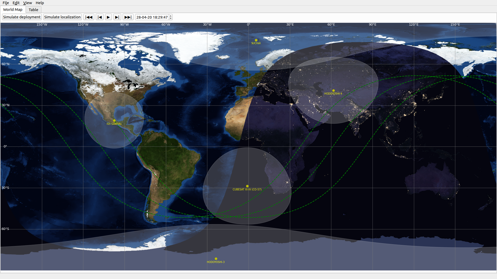

# Pypredict

[](https://github.com/spel-uchile/Pypredict/releases)
[](https://www.gnu.org/licenses/gpl-3.0.en.html)

This software is a python version of "Gpredict". It displays any satellite's position and orbital parameters in real time. It can also simulate satellite deployments from one satellite to another with different velocities, considering the mass of the satellites. In the near future it will be able to simulate range-based localization systems using TDOA.

Current version: 3.1.1



### Supported software:

* Python 3.7.15
* Matplotlib 3.2.1
* Ubuntu 19.10

### Installation instructions:

1. Clone this repository:
```bash
git clone https://github.com/spel-uchile/Pypredict.git
```
2. Move to the Pypredict folder:
```bash
cd Pypredict/
```
3. Install Pypredict:
```bash
sudo sh install.sh
```

### Usage:
```bash
python3 Pypredict.py
```

### Contact:

* Name: Matías Vidal Valladares
* e-mail: matias.vidal.v@gmail.com
