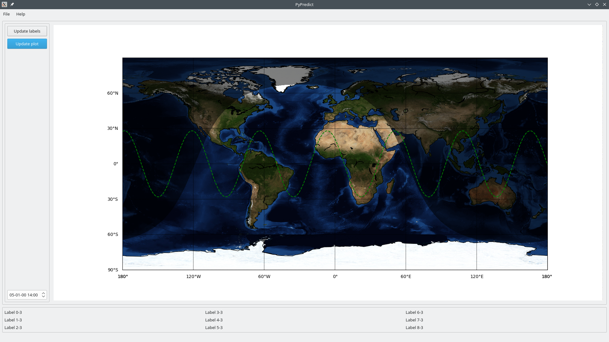

# PyQt5 with Matplotlib example
PyQt5 with Matplotlib and map example GUI application

    # Build UI
    sh convert_ui.sh main_window.ui main_window.py
    # Execute
    python3 main.py

Sample screenshot

Created with QtDesigner and translated to PyQt5

